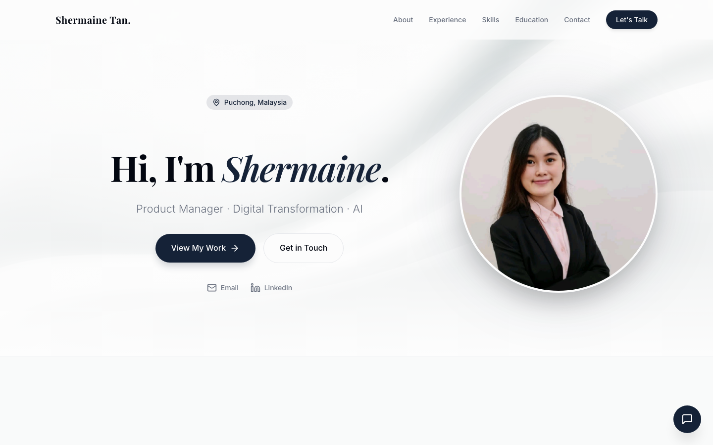

# Shermaine Tan — Portfolio

My personal portfolio site, showcasing my work as a Product Manager focused on digital transformation and AI.

**Live site:** [huuyin.github.io/shermaine](https://huuyin.github.io/shermaine/)

## About this site

A single-page site covering:

- **About** — background and summary
- **Experience** — work history
- **Skills** — core competencies
- **Education**
- **Additional Initiatives** — personal projects and experiments, each with a short demo video
- **Contact** — email and LinkedIn, plus a chat widget

## How it's built

This repo holds the **built static output** only (HTML/CSS/JS generated by [Hugo](https://gohugo.io)), deployed via GitHub Pages. The Hugo source and build workflow live in a separate (private) staging repo — this repo is updated by copying the generated `public/` output here and pushing.

## Recent Updates

- **2026-07-11** — Added "Requirement-to-Gantt Planner" to Additional Initiatives, with demo video
- **2026-06-27** — Rebuilt with correct production baseURL, removing leftover localhost artifacts
- **2026-06-27** — Added CV/resume PDF to the production site
- **2026-05-26** — Updated Digital Loyalty & Rewards project title and tags
- **2026-05-26** — Fixed static asset paths and Jekyll interference for GitHub Pages subdirectory deployment
- **2026-05-26** — Initial commit
